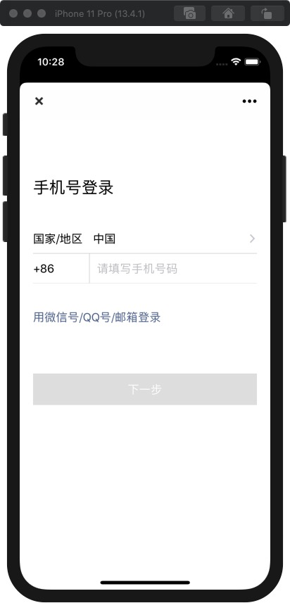
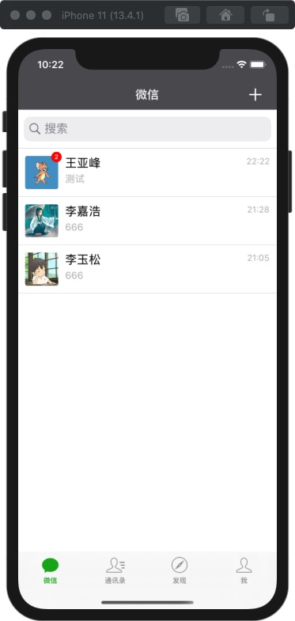
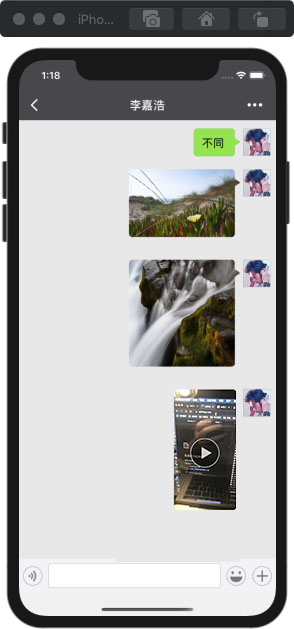
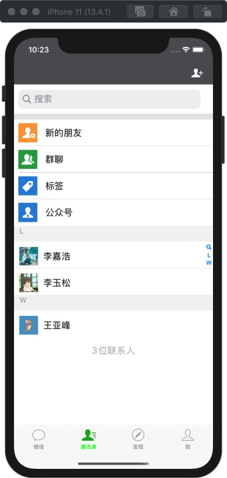

# WeChatCP
### 后端服务项目：
##### https://github.com/lwytry/WeChatApi

## 高仿微信计划：
### 已经实现功能 (基于基础原生框架)
1. 微信首页
	* 消息列表（新会话加入，DB）
	* 未读消息标记
	* 实时通讯
	* 文字消息
	* 图片消息
	* 视频消息
	* 视频聊天
2. 通讯录
	* 好友列表（分组算法、DB）
	* 好友资料 (基础)
3. 发现界
	* 界面 (整体UI)
4. 我界
	* 界面 (整体UI)
### 待实现功能（接下来一个月陆续完成）
1. 微信首页: 语音消息

2. 通讯录: 扫一扫、搜索 添加好友

3. 朋友圈

## 项目主要使用的第三方库
* [Masonry](https://github.com/SnapKit/Masonry)：自动布局框架，简洁高效
* [FMDB](https://github.com/ccgus/fmdb)：sqlite数据库管理框架
* [AFNetworking](https://github.com/AFNetworking/AFNetworking)：网络请求
* [MJExtension](https://github.com/CoderMJLee/MJExtension)：JSON - Model互转框架，高效低耦合
* [MJRefresh](https://github.com/CoderMJLee/MJRefresh)：下拉刷新，上拉加载更多，继承简单
* [SocketRocket](https://github.com/facebookarchive/SocketRocket)：socket通信
## 部分截图
       
